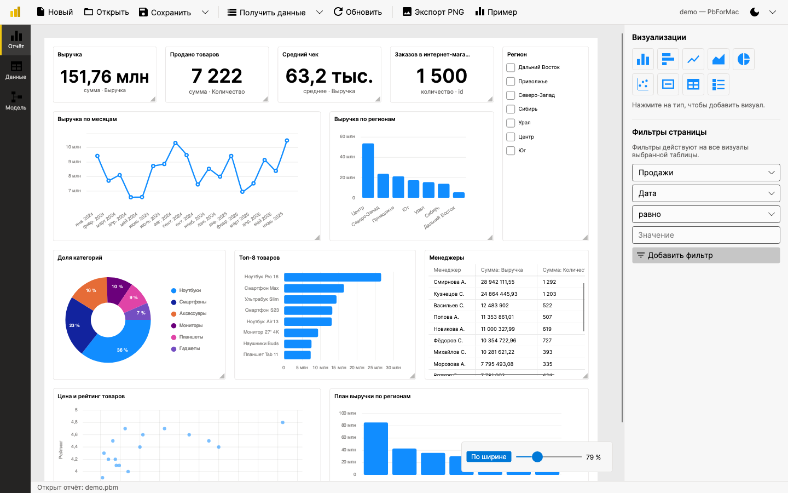
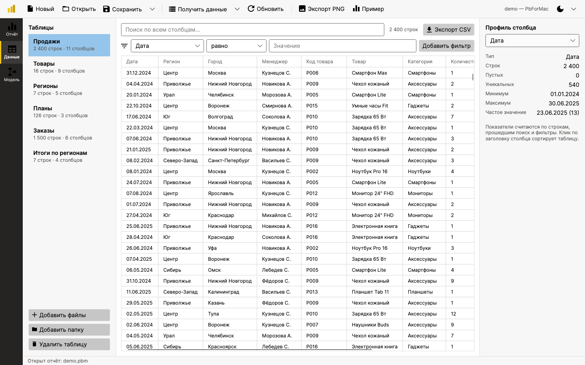
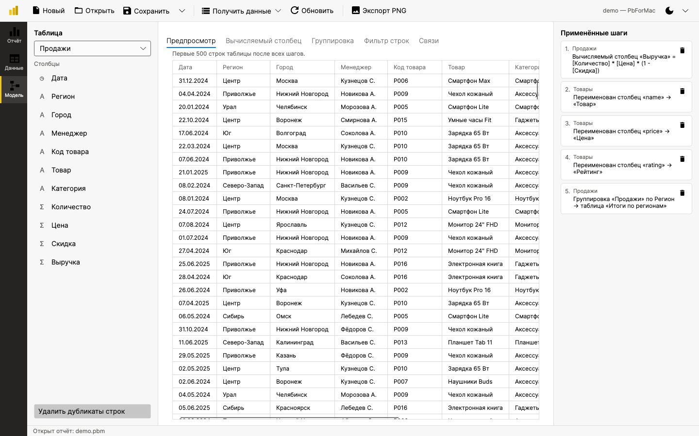
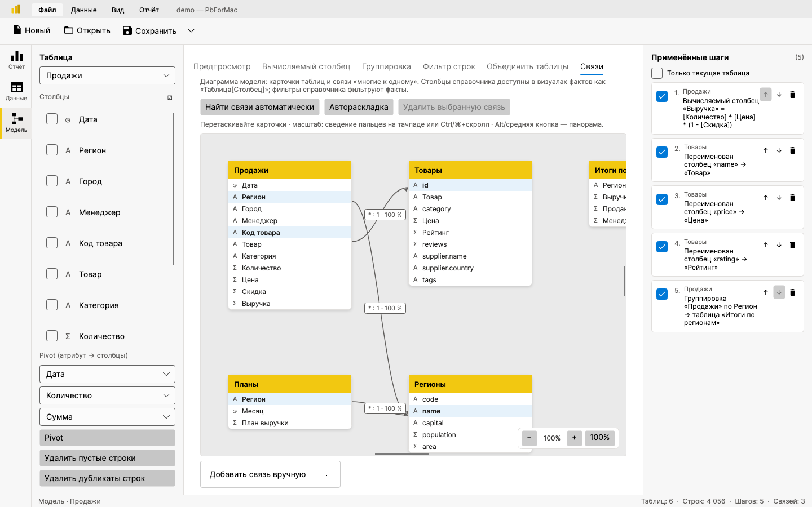
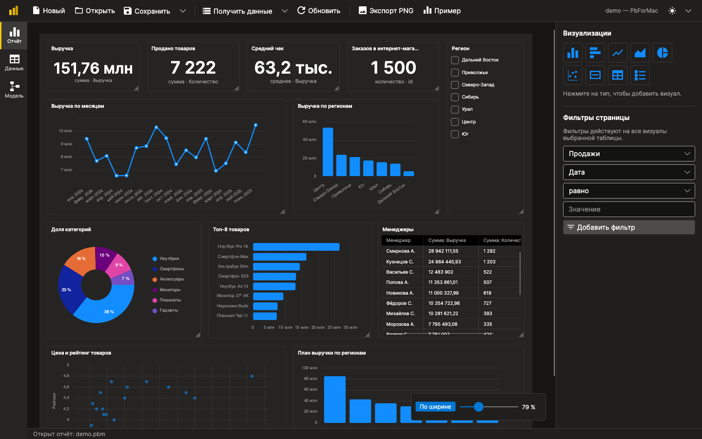

<p align="center">
  
</p>

<h1 align="center">PbForMac</h1>

<p align="center">
  Простой настольный аналог Power BI для macOS (а также Windows и Linux) на C# и Avalonia UI.<br>
  <em>A lightweight Power BI–style data analysis app built with .NET 10 and Avalonia.</em>
</p>

<p align="center">
  <a href="https://github.com/Antongo22/pb_for_mac/actions/workflows/build.yml"></a>
  
  
  <a href="LICENSE"></a>
</p>



## Возможности

- **Получение данных** из CSV/TSV, Excel (`.xlsx`), JSON, XML и SQLite. Файлы и папки можно выбрать через диалог или просто перетащить в окно.
  - **Папка вместе с подпапками** (как источник «Папка» в Power BI). Способ загрузки выбирается в диалоге:
    - **по подпапкам:** файлы из самой папки становятся отдельными таблицами, а файлы каждой подпапки
      (например, `sales/sales_v2_parts/sales_2024_01.csv … sales_2025_08.csv`) объединяются в одну таблицу с её именем;
    - **всё в одну таблицу:** строки всех файлов складываются по совпадающим столбцам,
      столбец «Файл» показывает путь к источнику строки;
    - **каждый файл отдельной таблицей.**

    Объединённые папки при нажатии «Обновить» подхватывают новые файлы.
  - CSV: автоопределение разделителя (`,` `;` `\t` `|`) и кодировки (UTF-8 / Windows-1251), русский формат чисел `1 234,56`.
  - Excel и SQLite: выбор листов / таблиц и представлений, несколько сразу.
  - JSON: массив объектов на любом уровне вложенности, вложенные объекты разворачиваются в столбцы `supplier.country`.
  - XML: строки находятся автоматически (повторяющиеся элементы), атрибуты и дочерние элементы становятся столбцами.
  - Типы столбцов (целое, десятичное, дата, логический, текст) определяются автоматически.
- **Данные** — таблицы разложены по папкам так же, как лежали файлы на диске (папки можно сворачивать и удалять целиком);
  просмотр таблиц с виртуализацией, сортировка по клику на заголовок, поиск по всем столбцам, быстрые фильтры, профиль столбца (пустые, уникальные, мин/макс, сумма, среднее, частое значение), экспорт в CSV.
- **Модель** — преобразования в стиле Power Query с журналом «Применённые шаги»:
  переименование, удаление столбцов и строк (ПКМ / Delete; также «оставить только выбранные»),
  перемещение столбцов, смена типа, дублирование, вычисляемые столбцы,
  **замена значений**, **заполнение вниз/вверх**, **разделение столбца** по разделителю,
  фильтр строк, удаление дубликатов и пустых строк, группировка с агрегатами в новую таблицу.
  Шаги можно отфильтровать по текущей таблице; они сохраняются в отчёте и повторяются при обновлении данных.
- **Связи между таблицами** («многие к одному», как в Power BI): продажи → товары → бренды, продажи → магазины.
  - находятся автоматически при загрузке: одноимённые ключевые столбцы (например, `ID_PRODUCT`) с уникальными
    значениями в справочнике;
  - на вкладке **«Модель → Связи»** — **визуальная диаграмма** модели: карточки таблиц, линии связей с подписью
    `* : 1` и долей совпадения ключей; карточки можно перетаскивать по неограниченному холсту, масштаб
    (кнопки или Ctrl+колёсико), автораскладка; связь можно создать кликом по столбцу факта, затем по столбцу
    справочника (или формой вручную);
  - столбцы справочников доступны в визуалах таблицы фактов как `Таблица[Столбец]`, в том числе через цепочку
    связей. Например, для продаж можно выбрать ось «Выручка по `Товары[Категория]`»;
  - фильтры и срезы справочника фильтруют связанные таблицы фактов: срез по `Регионы[name]` отфильтрует и продажи, и планы.
    В обратную сторону, от фактов к справочнику, фильтр не действует.
- **Отчёт** — дашборд из плиток, которые можно перетаскивать и растягивать:
  гистограмма, линейчатая, график, диаграмма с областями, круговая, точечная, KPI-карточка, таблица (сводная) и срез.
  Агрегации: сумма, среднее, количество, количество уникальных, минимум, максимум; детализация дат (день/месяц/квартал/год), Топ-N.
  Панель **«Области полей»** оформлена как в Power BI: отдельные «колодцы» для оси/легенды и значений.
- **Фильтры страницы и срезы** перекрёстно фильтруют все визуалы своей таблицы и связанных с ней таблиц.
- **Отчёты `.pbm`** (JSON) хранят источники, шаги, связи, позиции таблиц на диаграмме, визуалы и фильтры;
  пути к данным сохраняются относительно отчёта, поэтому папку можно переносить.
- Кнопка **«Обновить»** перечитывает все источники с диска, **экспорт дашборда в PNG**, светлая и тёмная тема (переключатель в верхней панели, выбор запоминается), меню macOS и горячие клавиши.
  В **строке состояния** — текущее действие и сводка модели (таблицы, строки, шаги, связи, визуалы); при выборе визуала показывается его тип и заголовок.
- Ширину боковых панелей можно менять, перетаскивая границу между ними. Приложение спрашивает подтверждение,
  прежде чем закрыть текущий отчёт (новый отчёт, открытие другого) и удалить таблицу, папку, визуал или шаг группировки
  (вместе с ним удаляется созданная им таблица), чтобы не потерять работу случайно.

| Данные | Модель |
|---|---|
|  |  |



<details>
<summary>Тёмная тема</summary>


</details>

## Установка

Есть два способа: скачать готовый пакет из Releases (ниже) или [собрать и установить из репозитория](#из-репозитория-сборка-из-исходников).

Готовые сборки лежат на странице **[Releases](https://github.com/Antongo22/pb_for_mac/releases/latest)**.
Приложение самодостаточное (self-contained): устанавливать .NET не нужно.

| Система | Файл |
|---|---|
| macOS на Apple Silicon (M1 и новее) | `PbForMac-osx-arm64.zip` |
| macOS на Intel | `PbForMac-osx-x64.zip` |
| Windows 10/11 (x64) | `PbForMac-win-x64.zip` |
| Windows на ARM | `PbForMac-win-arm64.zip` |
| Linux x64 | `PbForMac-linux-x64.tar.gz` |
| Linux ARM64 | `PbForMac-linux-arm64.tar.gz` |

### macOS

Требуется macOS 11 Big Sur или новее.

1. Узнайте тип процессора:  → «Об этом Mac». «Чип Apple M…» — берите `osx-arm64`, «Процессор Intel» — `osx-x64`.
2. Скачайте архив и распакуйте его (Safari делает это сам), затем перетащите **PbForMac.app** в папку **«Программы»**.
3. Первый запуск. Приложение не нотаризовано Apple, поэтому macOS заблокирует его при первом открытии:
   - **macOS 15 Sequoia и новее:** откройте PbForMac → в окне предупреждения нажмите «Готово» →
     **Системные настройки → Конфиденциальность и безопасность** → внизу «PbForMac заблокировано» → **«Всё равно открыть»** → введите пароль.
   - **macOS 14 и старше:** правый клик по PbForMac.app → **«Открыть»** → «Открыть».
   - Если macOS пишет, что приложение **«повреждено»**, или вы предпочитаете Терминал, снимите карантин одной командой:

     ```bash
     xattr -dr com.apple.quarantine /Applications/PbForMac.app
     ```

4. Дальше приложение запускается как обычно: из Launchpad, Spotlight или Dock. Файлы отчётов `.pbm` открываются двойным кликом.

**Удаление:** перетащите PbForMac.app из «Программ» в Корзину.

### Windows

Требуется Windows 10 (1809+) или Windows 11.

1. Скачайте архив, откройте правым кликом → **«Извлечь всё…»**.
2. В распакованной папке запустите **`install.cmd`**. Программа установится для текущего пользователя
   в `%LOCALAPPDATA%\Programs\PbForMac`, права администратора не нужны. Установщик добавит ярлык в меню «Пуск»
   и свяжет файлы `.pbm` с PbForMac. Чтобы добавить ярлык и на рабочий стол, выполните в этой папке `install.cmd -DesktopShortcut`.
3. Если появится **«Windows защитил ваш компьютер»** (SmartScreen), нажмите **«Подробнее» → «Выполнить в любом случае»**:
   у приложения нет платной цифровой подписи.
4. Запускайте PbForMac из меню «Пуск».

**Без установки (portable):** просто запустите `app\PbForMac.exe` из распакованной папки.

**Удаление:** «Параметры → Приложения → Установленные приложения → PbForMac → Удалить» или `uninstall.cmd` из архива.

### Linux

Нужен графический сеанс X11 или Wayland (через XWayland). Пакеты обычно уже установлены в дистрибутивах с рабочим столом.
Если приложение не запускается, установите зависимости:

```bash
# Debian / Ubuntu / Mint
sudo apt install libx11-6 libice6 libsm6 libfontconfig1 libicu-dev
# Fedora
sudo dnf install libX11 libICE libSM fontconfig libicu
# Arch / Manjaro
sudo pacman -S libx11 libice libsm fontconfig icu
```

Установка для текущего пользователя (без `sudo`):

```bash
tar -xzf PbForMac-linux-x64.tar.gz
cd PbForMac-linux-x64
./install.sh
```

Скрипт копирует приложение в `~/.local/share/pbformac`, добавляет пункт в меню приложений, команду `pbformac`
(в `~/.local/bin`) и тип файлов `.pbm`. Для установки в другой каталог укажите префикс: `PREFIX=/opt/pbformac ./install.sh`.

**Без установки (portable):** `./app/PbForMac`.

**Удаление:** `./install.sh --uninstall` из распакованной папки.

### Из репозитория (сборка из исходников)

Этот способ подойдёт, если нужна самая свежая версия из `main` или готовой сборки для вашей системы нет.
Скрипты собирают самодостаточное приложение и устанавливают его так же, как пакеты из Releases.

**1. Установите git и .NET 10 SDK**

| Система | Команда |
|---|---|
| macOS | `xcode-select --install` (git) и `brew install --cask dotnet-sdk` — или [установщик .NET](https://dotnet.microsoft.com/download/dotnet/10.0) |
| Windows | `winget install Git.Git Microsoft.DotNet.SDK.10` |
| Linux | git из менеджера пакетов (`sudo apt install git`, `sudo dnf install git`, …) и .NET [по инструкции для вашего дистрибутива](https://learn.microsoft.com/dotnet/core/install/linux) |

Для Linux есть и универсальный вариант без root: `curl -sSL https://dot.net/v1/dotnet-install.sh | bash -s -- --channel 10.0`
(затем добавьте `~/.dotnet` в `PATH`). Проверка: `dotnet --version` должна показать `10.x`.

**2. Скачайте репозиторий**

```bash
git clone https://github.com/Antongo22/pb_for_mac.git
cd pb_for_mac
```

**3. Соберите и установите**

macOS и Linux:

```bash
./scripts/install.sh
```

- **macOS:** `PbForMac.app` копируется в «Программы» (или в `~/Applications`, если нет прав записи).
  Приложение, собранное на вашем Mac, не блокируется Gatekeeper, поэтому шаги первого запуска выше не нужны.
- **Linux:** установка в `~/.local`, как у `install.sh` из пакета: пункт в меню приложений, команда `pbformac`, файлы `.pbm`.
  Если приложение не запускается, установите [зависимости](#linux).

Windows (PowerShell или командная строка, из папки репозитория):

```powershell
powershell -ExecutionPolicy Bypass -File scripts\install.ps1
```

Добавьте `-DesktopShortcut`, чтобы создать ярлык на рабочем столе. Установка идёт так же, как у `install.cmd` из пакета:
`%LOCALAPPDATA%\Programs\PbForMac`, ярлык в «Пуске», связь с `.pbm`, запись в «Параметры → Приложения».

**Обновление:** `git pull`, затем снова запустите скрипт установки.

**Удаление:** `./scripts/install.sh --uninstall` (macOS, Linux) или
`powershell -ExecutionPolicy Bypass -File scripts\install.ps1 -Uninstall` (Windows).

**Запуск без установки** (удобно при разработке):

```bash
dotnet run --project src/PbForMac
```

## Быстрый старт

Запустите PbForMac и на пустом отчёте нажмите **«Открыть пример»** (на macOS также меню **Файл → Открыть пример**).
Откроется демо-отчёт `samples/demo.pbm`,
построенный на данных всех пяти форматов. Отчёт или файл данных можно открыть и из командной строки:
`dotnet run --project src/PbForMac -- samples/demo.pbm` (или `pbformac файл.pbm` после установки на Linux).

### Как пользоваться

1. **Получить данные → Файлы…** — выберите один или несколько файлов, или **Получить данные → Папка (с подпапками)…** —
   выберите папку и способ загрузки. Таблицы появятся на странице «Данные». Папку можно и просто перетащить в окно.
   Через «Открыть» открываются отчёты и отдельные файлы данных. Выбрать там папку нельзя, для папок есть пункт «Папка…».
2. На странице **«Модель»** добавьте нужные преобразования, например вычисляемый столбец `Выручка = [Количество] * [Цена]`.
3. На странице **«Отчёт»** нажмите на тип визуализации в правой панели — визуал появится на холсте с автоматически подобранными полями.
   Поменяйте поля, агрегацию и заголовок в панели **«Области полей»**. Если визуал выбран, нажатие на другой тип меняет его вид.
4. Добавьте **срез** или **фильтр страницы**, чтобы фильтровать все визуалы таблицы.
5. **Сохранить** → файл `.pbm`. **Экспорт PNG** сохраняет дашборд картинкой.

### Выражения вычисляемых столбцов

Используется синтаксис [`DataColumn.Expression`](https://learn.microsoft.com/dotnet/api/system.data.datacolumn.expression):

```text
[Цена] * [Количество] * (1 - [Скидка])
IIF([Сумма] > 100000, 'Крупный', 'Обычный')
Len([Товар])
Substring([Код товара], 1, 2)
IsNull([Скидка], 0)
Convert([Количество], 'System.Double') / 12
```

### Горячие клавиши

| Действие | macOS | Windows / Linux |
|---|---|---|
| Новый / открыть / сохранить отчёт | ⌘N / ⌘O / ⌘S | Ctrl+N / Ctrl+O / Ctrl+S |
| Сохранить как | ⇧⌘S | Ctrl+Shift+S |
| Получить данные из файлов / из папки | ⌘I / ⇧⌘I | Ctrl+I / Ctrl+Shift+I |
| Обновить данные | ⌘R | Ctrl+R |
| Переключить светлую / тёмную тему | ⇧⌘T | Ctrl+Shift+T |
| Экспорт в PNG | ⌘E | Ctrl+E |
| Страницы Отчёт / Данные / Модель | ⌘1 / ⌘2 / ⌘3 | Ctrl+1 / Ctrl+2 / Ctrl+3 |
| Удалить выбранный визуал | ⌫ | Delete |

## Сборка пакетов

Скрипт `scripts/package.sh` собирает тот же пакет, что публикуется в Releases, для любой платформы
(на macOS/Linux, а на Windows — в Git Bash):

```bash
scripts/package.sh osx-arm64     # artifacts/PbForMac-osx-arm64.zip  (PbForMac.app, только на macOS)
scripts/package.sh osx-x64
scripts/package.sh win-x64       # artifacts/PbForMac-win-x64.zip    (app\ + install.cmd)
scripts/package.sh win-arm64
scripts/package.sh linux-x64     # artifacts/PbForMac-linux-x64.tar.gz (app/ + install.sh)
scripts/package.sh linux-arm64
```

Только `.app` без архива: `scripts/publish-macos.sh [osx-arm64|osx-x64]` → `artifacts/<rid>/PbForMac.app`.

**Выпуск релиза.** GitHub Actions на каждый push собирает и тестирует проект на macOS, Linux и Windows.
Если отправить тег `v*`, он соберёт все шесть пакетов и создаст GitHub Release с ними:

```bash
git tag v0.1.0
git push origin v0.1.0
```

## Структура проекта

```text
src/PbForMac/
  Models/            описания отчёта: источники, шаги преобразований, визуалы, фильтры
  Services/
    Importers/       CSV, Excel, JSON, XML, SQLite → DataTable
    TypeInference    определение типов столбцов
    QueryEngine      фильтры, агрегации, группировка
    TransformEngine  применение шагов преобразования
    DataModel        исходные таблицы + шаги → итоговые таблицы модели
    ReportSerializer сохранение/загрузка .pbm
  ViewModels/        MVVM (CommunityToolkit.Mvvm): страницы и визуалы
  Views/             Avalonia XAML: главное окно, страницы, плитки дашборда, диалоги
  Controls/          DataTableGrid — DataGrid для произвольной DataTable
tests/PbForMac.Tests/   xUnit: импорт, типы, движки, модель, демо-отчёт
tools/SampleDataGenerator/  генератор демо-данных в samples/
tools/Screenshots/          headless-скриншоты для README и иконка приложения
samples/               демо-данные и отчёт demo.pbm
scripts/               установка из исходников (install.sh / install.ps1), сборка пакетов (package.sh) и .app
packaging/             установщики для Windows (install.cmd/.ps1) и Linux (install.sh, .desktop)
```

Внутренняя модель данных — `System.Data.DataTable`: импортёры возвращают «сырые» значения, `TypeInference` приводит
их к типам, `DataModel` применяет шаги к копиям исходных таблиц, а визуалы строятся через `QueryEngine` с учётом фильтров и срезов.

## Разработка

```bash
dotnet test                                         # тесты
dotnet run --project tools/SampleDataGenerator      # пересоздать samples/
dotnet run --project tools/Screenshots              # обновить скриншоты в docs/
dotnet run --project tools/Screenshots -- docs dark # скриншоты тёмной темы
dotnet run --project tools/Screenshots -- icon      # перерисовать иконку
```

## Стек

[Avalonia UI](https://avaloniaui.net) 11.3 · [LiveCharts2](https://livecharts.dev) · [CommunityToolkit.Mvvm](https://learn.microsoft.com/dotnet/communitytoolkit/mvvm/) ·
[ClosedXML](https://github.com/ClosedXML/ClosedXML) · [CsvHelper](https://joshclose.github.io/CsvHelper/) · [Microsoft.Data.Sqlite](https://learn.microsoft.com/dotnet/standard/data/sqlite/)

## Лицензия

[MIT](LICENSE). Часть иконок интерфейса — [Material Design Icons](https://github.com/google/material-design-icons) (Apache License 2.0).
